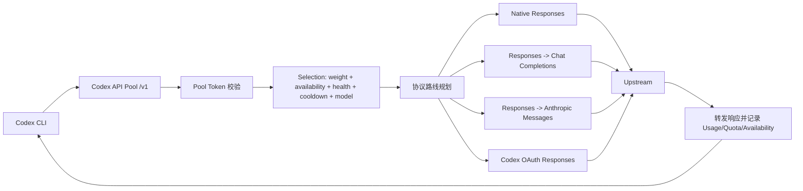

# Codex API Pool

Codex API Pool 是一个运行在本机的 OpenAI-compatible API Pool。Codex 只连接本地入口，API Pool 在背后根据 Upstream 健康、可用率、冷却状态、模型能力和权重选择真正的上游。

默认本地入口：

```text
OpenAI-compatible API: http://127.0.0.1:8787/v1
Management Dashboard: http://127.0.0.1:8787/pool/dashboard
Health:                http://127.0.0.1:8787/health
```

## 当前架构

项目现在由一个 Node.js 进程承载三类能力：

| 层 | 入口 | 作用 |
| --- | --- | --- |
| Model API | `/v1/*` | 给 Codex 暴露 OpenAI-compatible 接口，处理鉴权、Selection、Retry、Fallback、协议适配和流式转发。 |
| Management API | `/pool/*` | 查看 Runtime State、管理 Upstream、触发 Health Probe、刷新 Billing、切换 Model Override、导入 JSON。 |
| Runtime State | `stats.local.json` 和内存状态 | 保存 Usage、Quota、Availability、Recent Requests、Protocol Capabilities、Health State、Billing 等运行态信息。 |

核心请求路径：



### 协议路线

Codex 侧推荐始终使用 `wire_api = "responses"`。API Pool 会根据模型和 Upstream 能力选择路线：

| Codex 请求 | Upstream 类型 | 行为 |
| --- | --- | --- |
| `/v1/responses`, GPT/Codex 模型 | OpenAI Responses | 原样转发到 Upstream 的 Responses 接口。 |
| `/v1/responses`, GPT/Codex 模型 | Chat Completions-only | 将 Responses payload 转成 Chat Completions，并把 JSON/SSE 转回 Responses 形状。 |
| `/v1/responses`, `claude-*` 模型 | Anthropic Messages | 将 Responses payload 转成 Anthropic Messages，并把 JSON/SSE 转回 Responses 形状。 |
| `/v1/responses` | Codex OAuth account | 按 Codex OAuth 需要的 headers 转发到 ChatGPT Codex backend。 |
| `/v1/models` 等其他路径 | OpenAI-compatible Upstream | 去掉本地前缀后透传。 |

当请求包含当前适配器无法无损转换的 Responses 特性时，API Pool 会优先寻找原生 Responses Upstream；没有合适候选时返回带诊断信息的 `422`，避免静默降级。

如果你明确接受普通对话优先于完整 Responses 语义，可以在 Dashboard 打开 Adapter 兼容模式，或在配置中启用：

```json
{
  "compatibility": {
    "adapter_mode": {
      "strip_responses_only_features": true,
      "adapters": {
        "anthropic_messages": true,
        "chat_completions": true
      }
    }
  }
}
```

开启后，只有在没有可用原生 Responses Route 时，API Pool 才会按目标 API 的官方字段做兼容转换，然后再走 Anthropic Messages 或 Chat Completions adapter。每次请求都会通过响应头和 Recent Request Timeline 标明本次发生了哪些 `converted`、`downgraded`、`stripped`：

- `input_image` 会转成 Chat Completions 的 `image_url` content part，或 Anthropic Messages 的 `image` content block。
- `input_file` 会按目标 API 细分转换：Chat Completions 支持 `file_id` 或 `file_data`/`filename` 的 `file` content part；Anthropic Messages 支持 PDF/text/URL 形态的 `document` content block。Chat Completions 没有 `file_url` 字段，遇到只有 `file_url` 的文件块时会剔除并上报。
- 如果用户内容块主体被保留，但目标 API 没有等价子字段，会在 `downgraded.fields` 里上报，例如 `input_image.detail` 或 `input_file.detail`。
- `custom_tool_call` / `custom_tool_call_output` 会转成 Chat tool calls/tool messages，或 Anthropic `tool_use` / `tool_result`。
- `custom` tools 会转成 Chat custom tools；到 Anthropic 时会降级成普通 client tool。
- `namespace` tools 会展开成带 namespace 前缀的普通工具。
- `web_search` / `web_search_preview` 会转成 Chat `web_search_options` 或 Anthropic `web_search_20260209`，并标记为降级，因为返回的 hosted-tool 事件形状不完全相同。
- `tool_search` 会转成 Anthropic `tool_search_tool_bm25_20251119`；Chat Completions 没有等价字段，只能剔除并上报。
- `text.verbosity` 会转成 Chat 顶层 `verbosity`；Anthropic Messages 没有等价字段，只能剔除并上报。
- `reasoning.effort` 会转成 Chat `reasoning_effort` 或 Anthropic `output_config.effort`；Responses reasoning 输入项、`previous_response_id`、`conversation`、`include`、`background`、`truncation`、`context_management`、`prompt`、`moderation`、`max_tool_calls` 这类 Responses 状态/输出控制字段没有 Chat/Claude 等价字段，只能剔除并上报。
- `image_generation` 是 Responses 原生图片生成工具，Chat Completions 和 Anthropic Messages 没有等价工具，只能剔除并上报。

用户文本和已确认可映射的多模态内容不会被静默剔除；被剔除的内容必须出现在 `x-codex-api-pool-stripped` 和 Recent Request Timeline 中。

### Selection 与 Retry

Selection 会先排除这些候选：

- Disabled Upstream
- Quarantined Upstream
- 缺少 Upstream Key
- Upstream 或 Key 处于 Cooldown
- Codex OAuth token 已过期
- Health State 明确不可用
- 与 Requested Model 或 Model Override 不匹配
- 对当前请求不支持所需协议能力

剩余候选按动态分数抽选：

```text
selection_score = weight * availability_multiplier
                  / (1 + in_flight + latency_penalty + health_penalty + failure_penalty)
```

默认可重试状态码：

```text
400, 401, 403, 404, 408, 409, 425, 429,
500, 502, 503, 504, 521, 522, 523, 524
```

重要边界：API Pool 只会在 Upstream 开始返回成功响应前 Retry 或 Fallback。一旦 Upstream 返回 `200` 并开始流式输出，API Pool 会直接转发该流；如果之后中途断流，无法无损续接同一个生成，只能让当前 Codex turn 失败或由 Codex 重新发起。

## 文件结构

| 文件 | 作用 |
| --- | --- |
| `src/server.mjs` | API Pool 主服务，包含 Model API、Management API、Selection、Retry、适配器、Dashboard 和状态持久化。 |
| `src/codex-oauth/*.mjs` | Codex OAuth account 导入、JWT 元数据解析、secret materialize 和运行态投影。 |
| `scripts/add-upstream.mjs` | 通过 Management API 添加或替换 Upstream。 |
| `scripts/set-model.mjs` | 通过 Management API 设置 `model_override`。 |
| `scripts/service.mjs` | 生成和管理 macOS LaunchAgent。 |
| `config.example.json` | Pool Configuration 示例。 |
| `config.local.json` | 本机 Pool Configuration，默认启动路径，不提交。 |
| `secrets.local.json` | Codex OAuth secret 存储，按需生成，不提交。 |
| `stats.local.json` | Runtime State 持久化文件，按需生成，不提交。 |
| `test/smoke-test.mjs` | 端到端烟测。 |
| `CONTEXT.md` | 领域词汇说明。 |

## 快速启动

要求 Node.js `>=18`。

```bash
cd /Users/slizm/myprojects/codex-api-pool
cp config.example.json config.local.json
```

推荐把 Pool Token 和 Upstream Key 放到 shell 环境里：

```bash
# Codex -> 本地 API Pool，只用于进入本地池，不转发给 Upstream
export CODEX_POOL_API_KEY="本地池访问令牌"

# API Pool -> 各 Upstream，只发给对应 Upstream
export RAWCHAT_API_KEY="rawchat 的 key"
export SUB2API_API_KEY="sub2api 的 key"
export BLACK_API_KEY="black 的 key"
```

前台启动：

```bash
npm run start
```

也可以显式指定配置：

```bash
CODEX_POOL_CONFIG=/Users/slizm/myprojects/codex-api-pool/config.local.json node src/server.mjs
```

检查：

```bash
curl -s http://127.0.0.1:8787/health
curl -s http://127.0.0.1:8787/pool/status
```

如果 `server.admin_auth_token_env` 配了环境变量，访问 Management API 时要带 Admin Token：

```bash
curl -s http://127.0.0.1:8787/pool/status \
  -H "Authorization: Bearer $CODEX_POOL_API_KEY"
```

## Codex 配置

把 `~/.codex/config.toml` 的默认模型 provider 指向本地池：

```toml
model = "gpt-5.5"
model_reasoning_effort = "medium"
model_provider = "api_pool"

[model_providers.api_pool]
name = "Local Codex API Pool"
base_url = "http://127.0.0.1:8787/v1"
wire_api = "responses"
env_key = "CODEX_POOL_API_KEY"
```

只要 `model_provider = "api_pool"`，Codex 就会走本地池。原来直连单个中转站的 provider 可以保留，方便手动回退。

## Pool Configuration

`config.local.json` 的主要结构：

```json
{
  "server": {
    "host": "127.0.0.1",
    "port": 8787,
    "public_prefix": "/v1",
    "auth_token_env": "CODEX_POOL_API_KEY",
    "admin_auth_token_env": "",
    "max_body_bytes": 52428800,
    "request_timeout_ms": 180000,
    "graceful_shutdown_ms": 15000
  },
  "model_override": "",
  "retry": {
    "max_attempts": 4,
    "failure_threshold": 2,
    "base_cooldown_ms": 30000,
    "key_cooldown_ms": 60000,
    "chat_fallback_probe_timeout_ms": 15000,
    "native_responses_recheck_ms": 1800000
  },
  "availability": {
    "window_size": 50,
    "min_samples": 10
  },
  "health": {
    "enabled": false,
    "interval_ms": 60000,
    "timeout_ms": 10000,
    "concurrency": 4,
    "path": "/models"
  },
  "billing": {
    "timeout_ms": 10000,
    "concurrency": 3
  },
  "stats": {
    "path": "stats.local.json"
  },
  "upstreams": []
}
```

`retry.native_responses_recheck_ms` controls the Native Responses Recheck window. When an automatic Upstream falls back to Chat Completions, the API Pool can reuse that learned Forwarding Strategy briefly, then try `/v1/responses` first again after the window expires or after newer Responses probe evidence appears.

### Token 分层

| 名称 | 配置 | 用途 |
| --- | --- | --- |
| Pool Token | `server.auth_token_env` | Codex 调用 `/v1/*` 时使用，只在本地校验，不转发给 Upstream。 |
| Admin Token | `server.admin_auth_token_env` | 访问 `/pool/*` Management API 时使用。为空表示本机管理接口不强制 Bearer token。 |
| Upstream Key | `upstreams[].keys[].env` 或 `value` | API Pool 调用外部 Upstream 时使用。推荐引用环境变量。 |

如果配置了某个 token env，但服务进程读不到对应环境变量，请求会被拒绝。只有把配置值显式留空，才表示关闭该层鉴权。

### Upstream 配置

最小 OpenAI-compatible Upstream：

```json
{
  "name": "rawchat",
  "api": "openai",
  "base_url": "https://new.sharedchat.cc/codex",
  "weight": 3,
  "keys": [{ "env": "RAWCHAT_API_KEY" }]
}
```

Anthropic-only Upstream：

```json
{
  "name": "runanytime_claude",
  "api": "anthropic",
  "base_url": "https://runanytime.example",
  "health_path": "/v1/models",
  "probe_auth": "anthropic",
  "weight": 1,
  "keys": [{ "env": "RUN_CLAUDE_API_KEY" }]
}
```

同时支持 OpenAI-compatible 和 Anthropic Messages 的 Upstream 使用：

```json
{
  "name": "dual",
  "api": "both",
  "base_url": "https://example.com/v1",
  "weight": 1,
  "keys": [{ "env": "DUAL_API_KEY" }]
}
```

常用字段：

| 字段 | 说明 |
| --- | --- |
| `api` | `openai`、`anthropic` 或 `both`。影响 Claude/GPT 模型的候选过滤。 |
| `request_mode` | `auto`、`responses`、`chat_completions` 或 `codex_oauth`。未配置时自动判断。 |
| `weight` | 基础权重，越高越容易被选中，但仍受 Availability、Cooldown、延迟和失败惩罚影响。 |
| `keys` | 可配置多个 Upstream Key。每个 key 有独立失败次数、Cooldown、Health 和 Quota。 |
| `quarantined` | 设为 `true` 时持久放入隔离区，不参与 Selection，但仍可手动探测和刷新单站 Billing。 |
| `proxy_url` | 可选 HTTP 代理，例如 `http://127.0.0.1:7897`，HTTPS 会走 CONNECT 隧道。 |
| `site_url` | 管理面板打开 Upstream 站点用。 |
| `signin_available` | 标记该 Upstream 是否需要每日签到。 |
| `billing` | 自定义 Billing probe 路径和字段。 |

## 运行方式

### 前台运行

```bash
cd /Users/slizm/myprojects/codex-api-pool
npm run start
```

### macOS LaunchAgent

服务脚本会生成用户级 LaunchAgent，并让 launchd 守护进程：

```bash
npm run service:install
npm run service:status
npm run service:restart
npm run service:stop
npm run service:uninstall
```

默认信息：

```text
Label:  com.slizm.codex-api-pool
plist:  ~/Library/LaunchAgents/com.slizm.codex-api-pool.plist
stdout: /Users/slizm/myprojects/codex-api-pool/pool.out.log
stderr: /Users/slizm/myprojects/codex-api-pool/pool.err.log
```

安装但不立即启动：

```bash
npm run service -- install --no-start
```

预览 plist：

```bash
npm run service -- plist
```

LaunchAgent 会先加载 `~/.zshrc`，所以 `CODEX_POOL_API_KEY` 和各 Upstream Key 应放在 `~/.zshrc` 或它会加载的文件中。

### nohup 兜底

如果 launchd 不可用，可以临时用 `nohup`：

```bash
nohup /bin/zsh -lc 'source ~/.zshrc; exec node /Users/slizm/myprojects/codex-api-pool/src/server.mjs /Users/slizm/myprojects/codex-api-pool/config.local.json' \
  >> /Users/slizm/myprojects/codex-api-pool/pool.out.log \
  2>> /Users/slizm/myprojects/codex-api-pool/pool.err.log \
  < /dev/null &
```

查看监听：

```bash
lsof -nP -iTCP:8787 -sTCP:LISTEN
```

## 日常操作

### 管理面板

打开：

```text
http://127.0.0.1:8787/pool/dashboard
```

Dashboard 是本地 Operational Console，主要用于：

- 看 API Pool 是否可用、降级或被阻塞
- 查看 Upstream Health State、Cooldown、Availability、Usage、Billing、Quota
- 查看 Recent Request Timeline 和 Fallback 证据
- 添加、编辑、删除、启用、停用 Upstream
- 将不稳定 Upstream 移入隔离区，或手动恢复为 Active
- 触发单个或全部 Health Probe
- 切换 Model Override
- 导入 JSON Upstream 或 Codex OAuth account
- 对 Upstream 执行 curl-style 诊断

如果启用了 Admin Token，页面右上角填写 token 后会保存在浏览器本地存储。

### 切换 Model Override

保持 Codex 连接本地池不变，通过 API Pool 改写 outgoing request body 里的 `model`：

```bash
npm run model -- gpt
npm run model -- claude
npm run model -- off
```

别名：

| 别名 | 实际模型 |
| --- | --- |
| `gpt` | `gpt-5.5` |
| `claude` | `claude-opus-4-8` |
| `off` | 清空 override，使用 Codex 请求中的 Requested Model |

也可以传完整模型名：

```bash
npm run model -- claude-opus-4-8
npm run model -- gpt-5.5
```

如果 Management API 启用了鉴权，脚本默认从 `CODEX_POOL_API_KEY` 读取 Admin Token；也可以指定：

```bash
npm run model -- claude --token-env CODEX_POOL_ADMIN_TOKEN
```

### 添加 Upstream

运行中的 API Pool 可以不重启直接添加 Upstream：

```bash
npm run add -- mysite https://example.com/v1 2 MY_SITE_API_KEY --site-url https://example.com
```

常用参数：

| 参数 | 说明 |
| --- | --- |
| `name` | Upstream 名称，只能包含字母、数字、点、下划线、短横线。 |
| `base_url` | Upstream API base URL。 |
| `weight` | 基础权重。 |
| `key_env` 或 `--key-env` | 保存 Upstream Key 的环境变量名。 |
| `--key sk-...` | 将明文 key 写入 `config.local.json`，只适合确认本机文件安全的场景。 |
| `--api openai|anthropic|both` | 显式声明协议能力。 |
| `--replace` | 替换同名 Upstream。 |
| `--pool-url` | Management API 地址，默认 `http://127.0.0.1:8787`。 |
| `--token-env` | Admin Token 环境变量，默认 `CODEX_POOL_API_KEY`。 |

HTTP 等价接口：

```bash
curl -s -X POST http://127.0.0.1:8787/pool/upstreams \
  -H "Authorization: Bearer $CODEX_POOL_API_KEY" \
  -H "Content-Type: application/json" \
  -d '{
    "name": "mysite",
    "base_url": "https://example.com/v1",
    "weight": 2,
    "keys": [{ "env": "MY_SITE_API_KEY" }]
  }'
```

如果没有显式传 `api` 或 `probe_auth`，API Pool 会在添加后尝试探测 OpenAI-compatible 和 Anthropic 能力，并把识别结果写回配置。

### 批量导入

Dashboard 支持上传 sub2api、cpa 或通用 JSON。Management API：

```bash
curl -s -X POST 'http://127.0.0.1:8787/pool/import/upstreams?replace=false&secret_mode=env' \
  -H "Authorization: Bearer $CODEX_POOL_API_KEY" \
  -H "Content-Type: application/json" \
  -d @sub2api-or-cpa.json
```

导入器会识别常见结构：

- 顶层数组
- `upstreams`、`sites`、`providers`、`endpoints`、`apis`、`proxies`、`nodes`
- `accounts`

`secret_mode=env` 会只写入自动生成的环境变量名，例如 `MYSITE_API_KEY`。`secret_mode=value` 会保存 JSON 里的明文 key，并在响应中返回明文警告。

如果导入的是 sub2api/Codex OAuth account export，API Pool 会写入 `codex_oauth.accounts`，并把 access token 等 secret 存到 `secrets.local.json`。原始 ChatGPT Web session JSON 不会被当作可用 Upstream。

### Health Probe

手动探测全部：

```bash
curl -s -X POST http://127.0.0.1:8787/pool/probe \
  -H "Authorization: Bearer $CODEX_POOL_API_KEY"
```

手动探测单个：

```bash
curl -s -X POST http://127.0.0.1:8787/pool/upstreams/rawchat/probe \
  -H "Authorization: Bearer $CODEX_POOL_API_KEY"
```

指定模型临时探测单个 Upstream：

```bash
curl -s -X POST http://127.0.0.1:8787/pool/upstreams/rawchat/probe \
  -H "Authorization: Bearer $CODEX_POOL_API_KEY" \
  -H "Content-Type: application/json" \
  -d '{"probe_model":"gpt-5.5"}'
```

Health Probe 使用当前 `model_override` 发送小型真实模型请求。OpenAI-compatible Upstream 会探测 Responses，必要时尝试 Chat Completions；Anthropic Upstream 会探测 Messages；Codex OAuth account 会做 Codex OAuth 路线诊断。

单个 Upstream 的手动 Health Probe 可以用 `probe_model` 临时指定本次 Probe Model。临时 Probe Model 不会修改全局 `model_override`；只有当它等于当前 `model_override` 时，探测结果才会写回 Upstream 的主 Health State 并影响 Selection。Dashboard 的 Upstream 行内 Probe Model 输入框也是这个语义，Discovered Models chips 只会填充该行输入框，不会切换全局 Model Override。

如果没有 `model_override`，Probe 会显示 `missing_model_override`，避免用随机默认模型误判 Upstream。切换 `model_override` 后，旧模型的探测结果会变成 `stale_model_override`，直到重新探测。

### 启用、停用、删除

```bash
curl -s -X POST http://127.0.0.1:8787/pool/upstreams/rawchat/enabled \
  -H "Authorization: Bearer $CODEX_POOL_API_KEY" \
  -H "Content-Type: application/json" \
  -d '{"enabled": false}'

curl -s -X POST http://127.0.0.1:8787/pool/upstreams/rawchat/enabled \
  -H "Authorization: Bearer $CODEX_POOL_API_KEY" \
  -H "Content-Type: application/json" \
  -d '{"enabled": true}'
```

删除：

```bash
curl -s -X DELETE http://127.0.0.1:8787/pool/upstreams/rawchat \
  -H "Authorization: Bearer $CODEX_POOL_API_KEY"
```

Disabled 是用户显式控制的状态，和 Cooldown 不同。Disabled Upstream 会保留在状态和 Dashboard 中，但不会参与 Selection。

### 隔离与恢复

Quarantined Upstream 是用户显式隔离的不稳定 Upstream。它会保留在配置、状态、Usage 和 Dashboard 隔离区抽屉中；抽屉默认收起，点击按钮后才展开站点列表。Quarantined Upstream 不会参与 Selection，也不会影响主页面的 active Health Probe 汇总或模型候选。

移入隔离区：

```bash
curl -s -X POST http://127.0.0.1:8787/pool/upstreams/rawchat/quarantine \
  -H "Authorization: Bearer $CODEX_POOL_API_KEY" \
  -H "Content-Type: application/json" \
  -d '{"quarantined": true}'
```

恢复为 Active：

```bash
curl -s -X POST http://127.0.0.1:8787/pool/upstreams/rawchat/quarantine \
  -H "Authorization: Bearer $CODEX_POOL_API_KEY" \
  -H "Content-Type: application/json" \
  -d '{"quarantined": false}'
```

恢复时会立即跑一次单站 Health Probe。手动单站 probe 和手动全量 probe 都可以测试 Quarantined Upstream；自动后台 Health Probe 会跳过它。

### Billing、Usage 与 Quota

刷新单个 Upstream Billing：

```bash
curl -s -X POST http://127.0.0.1:8787/pool/upstreams/rawchat/billing \
  -H "Authorization: Bearer $CODEX_POOL_API_KEY"
```

刷新全部：

```bash
curl -s -X POST http://127.0.0.1:8787/pool/billing \
  -H "Authorization: Bearer $CODEX_POOL_API_KEY"
```

全量 Billing 会跳过 Quarantined Upstream；单站 Billing 仍可手动刷新。

导出每日 token usage：

```bash
curl -s http://127.0.0.1:8787/pool/usage/daily.json
curl -s http://127.0.0.1:8787/pool/usage/daily.csv
```

Usage 来自模型响应里的 `usage` 字段、常见 token usage 响应头，或未压缩 SSE 最终事件。API Pool 不估算 token。`GET /v1/models`、Health Probe、Billing Probe 和 Management API 请求不计入模型 Usage 和 Availability。

Quota 来自 Upstream 响应头，例如：

```text
x-ratelimit-remaining-requests
x-ratelimit-remaining-tokens
x-ratelimit-limit-requests
x-ratelimit-limit-tokens
x-quota-remaining
retry-after
```

Billing 默认尝试常见 OpenAI-compatible 账单接口：

```text
/dashboard/billing/subscription
/dashboard/billing/usage?start_date={start_date}&end_date={end_date}
```

如果某个 Upstream 使用自定义接口，可以在 Upstream 上配置：

```json
{
  "billing": {
    "enabled": true,
    "base_url": "https://example.com",
    "subscription_path": "/api/billing",
    "usage_path": "/api/usage?start_date={start_date}&end_date={end_date}",
    "currency": "USD",
    "balance_field": "data.balance",
    "used_field": "data.used_amount",
    "limit_field": "data.limit",
    "amount_unit": "usd",
    "large_limit_threshold": 10000000,
    "trust_large_limits": false
  }
}
```

如果账单接口返回 HTML 登录页、Cloudflare challenge 或浏览器防护页，Billing 状态会显示 `blocked`。这不一定代表模型接口不可用。

## Management API 速查

| 方法 | 路径 | 作用 |
| --- | --- | --- |
| `GET` | `/health` | 服务存活检查，不要求 Admin Token。 |
| `GET` | `/pool/dashboard` | 本地管理面板。 |
| `GET` | `/pool/status` | 完整 Runtime State。 |
| `GET` | `/pool/upstreams` | 同 `/pool/status`，便于语义化读取 Upstream 列表。 |
| `GET` | `/pool/codex-oauth/accounts` | Codex OAuth account 状态。 |
| `GET` | `/pool/usage/daily.json` | 每日 token usage JSON。 |
| `GET` | `/pool/usage/daily.csv` | 每日 token usage CSV。 |
| `POST` | `/pool/model` | 设置或清空 Model Override。 |
| `POST` | `/pool/compatibility` | 设置 Adapter 兼容模式。 |
| `POST` | `/pool/probe` | 探测全部 Upstream。 |
| `POST` | `/pool/upstreams/:name/probe` | 探测单个 Upstream。 |
| `POST` | `/pool/claude-check` | 对全部 Upstream 做 Claude 能力检查。 |
| `POST` | `/pool/upstreams/:name/claude-check` | 对单个 Upstream 做 Claude 能力检查。 |
| `POST` | `/pool/billing` | 刷新全部 Billing。 |
| `POST` | `/pool/upstreams/:name/billing` | 刷新单个 Billing。 |
| `POST` | `/pool/upstreams` | 添加或替换 Upstream。 |
| `POST` | `/pool/import/upstreams` | 从 JSON 批量导入 Upstream 或 Codex OAuth account。 |
| `POST` | `/pool/upstreams/:name/enabled` | 启用或停用 Upstream。 |
| `POST` | `/pool/upstreams/:name/quarantine` | 隔离 Upstream 或恢复为 Active。 |
| `POST` | `/pool/upstreams/:name/signin` | 更新签到状态。 |
| `DELETE` | `/pool/upstreams/:name` | 删除 Upstream 或 Codex OAuth account。 |
| `POST` | `/pool/test-curl` | Dashboard 使用的 curl-style 诊断接口。 |

## Availability 规则

默认窗口是每个 Upstream 最近 50 次 Model Interaction Request attempt。样本少于 10 次时不惩罚。

```text
样本少于 10 次: 1.00
>= 95%:          1.20
>= 90%:          1.00
>= 75%:          0.65
>= 50%:          0.30
< 50%:           0.08
```

只有 HTTP 2xx/3xx 且响应里有具体模型输出才算成功。HTTP 错误、网络错误、超时、上游流式中断、空输出、显式 `output_tokens = 0` 都算失败。

## 常见排障

| 现象 | 优先检查 |
| --- | --- |
| Codex 返回 `unauthorized` | `CODEX_POOL_API_KEY` 是否同时存在于 Codex 环境和 API Pool 进程环境。 |
| `/pool/status` 返回 `unauthorized` | 是否配置了 `admin_auth_token_env`，请求是否带 Admin Token。 |
| Upstream 显示 `missing_key` | 对应 `keys[].env` 是否在 API Pool 进程环境中存在。 |
| Health 是 `missing_model_override` | 先执行 `npm run model -- gpt` 设置明确模型，再手动 Probe。 |
| Claude 请求没有候选 | Upstream 是否标记为 `api: "anthropic"` 或 `api: "both"`，且模型名以 `claude` 开头。 |
| GPT 请求误打 Claude-only Upstream | 确认 Claude-only Upstream 使用 `api: "anthropic"`。 |
| Billing 是 `blocked` | 账单端点可能需要网页登录或被 Cloudflare 防护，模型接口可能仍可用。 |
| 流式中途失败 | Streaming Boundary 之后不会续接，需要 Codex 重新发起请求。 |

## 自测

```bash
cd /Users/slizm/myprojects/codex-api-pool
npm run smoke
```

期望看到：

```text
smoke ok: ...
```

烟测覆盖鉴权、Fallback、启停 Upstream、Usage/Billing 统计、Availability、运行时添加、配置保留编辑、JSON 导入、模型发现、Anthropic 模型探测、Model Override、流式错误冷却、HTTP 400/522 Fallback、Recent Requests 和 Health Probe。

## 安全提示

- 推荐所有 Upstream Key 都用环境变量引用，不要把明文 key 写进 `config.local.json`。
- `server.admin_auth_token_env` 为空时，本机 `/pool/*` 不强制 Bearer token。只监听 `127.0.0.1` 时通常够用；如果暴露到其他网络，必须启用 Admin Token。
- `config.local.json`、`secrets.local.json`、`stats.local.json`、`pool.out.log`、`pool.err.log` 都可能包含敏感信息或运行痕迹，避免同步到共享位置。
- Pool Token、Admin Token、Upstream Key 是三个不同概念。Pool Token 不会转发给 Upstream。
